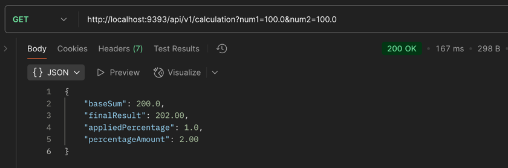
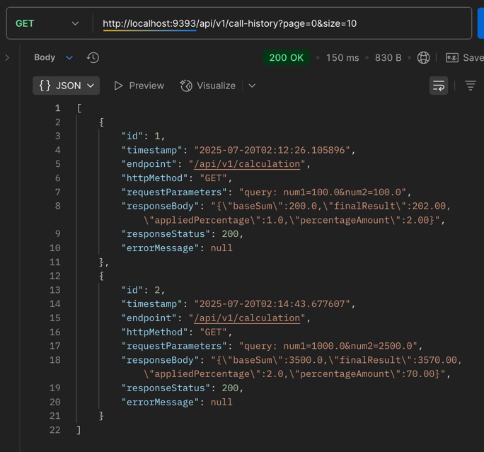
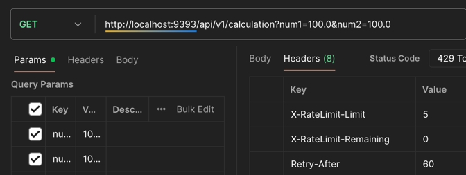
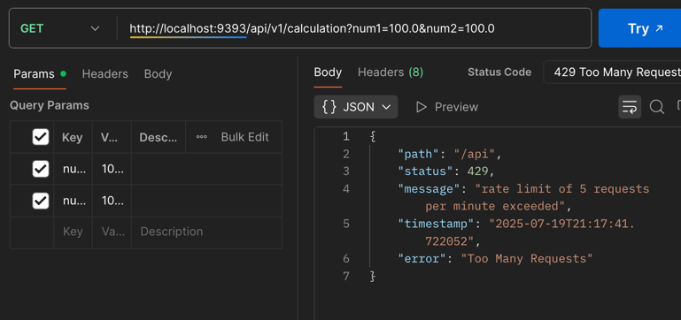
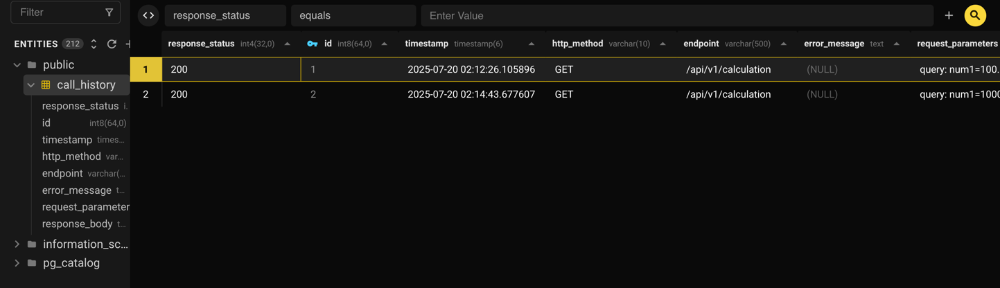
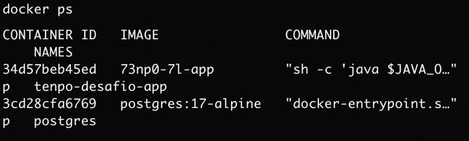

### Tenpo Challenge

## API REST en Spring Boot

## Endpoints

Colección de Postman con documentación de los endpoints:
[Colleción Postman](./assets/postman/tenpo-desafio-alberto-padilla.postman_collection.json)

Contiene ejemplos de respuestas OK y error de rate limit.

## Ejecutar servicio en Docker 🐳
```bash
docker-compose up -d
```

### 1. Cálculo de porcentaje dinámico:

El cálculo dinámico se realiza obteniendo un porcentaje desde un servicio externo y aplicándolo a la suma de dos números.

**Dependencias utilizadas:**
- `spring-retry`: implementa reintentos con backoff (3 intentos)
- `spring-boot-starter-cache` + `caffeine`: cache en memoria con TTL de 30 minutos (config. en application.yml)
- `spring-cloud-starter-openfeign`: cliente HTTP para consumir el servicio externo, mock habilitado (config. en application.yml)

```bash
GET /api/v1/calculation?num1=5&num2=5
```


### 2. Historial de llamadas

Se registran todas las llamadas a la API en PostgreSQL de forma asíncrona. 

Registra timestamp, endpoint, parámetros de request, respuesta y estado HTTP.

**Implementación:**
- `CallHistoryInterceptor`: interceptor HTTP que captura automáticamente todas las requests
- `@Async`: guardado asíncrono en BD para no impactar performance
- `RequestContext`: ThreadLocal para mantener contexto durante el ciclo de request
- Paginación: Soporte nativo con Spring Data JPA (page/size)

```bash
GET /api/v1/call-history?page=0&size=10
```


### 3. Rate limit (3 RPM)

Control de tráfico que limita los requests por minuto en ambos endpoints. 

**Implementación:**
- `RateLimitingInterceptor`: interceptor que valida límites antes de procesar requests
- `Bucket4j`: token bucket con refill de tokens por minuto (config. en application.yml)
- Headers informativos: 
  - `X-RateLimit-Limit`: limite de requests por minuto
  - `X-RateLimit-Remaining`: requests restantes en el minuto
  - `Retry-After`: tiempo en segundos para refrescar el token bucket





### Datos en BD PostgreSQL


## Docker



```bash
# Levantar servicios
docker-compose up -d

# Ver logs
docker-compose logs app

# Detener servicios
docker-compose down
```
